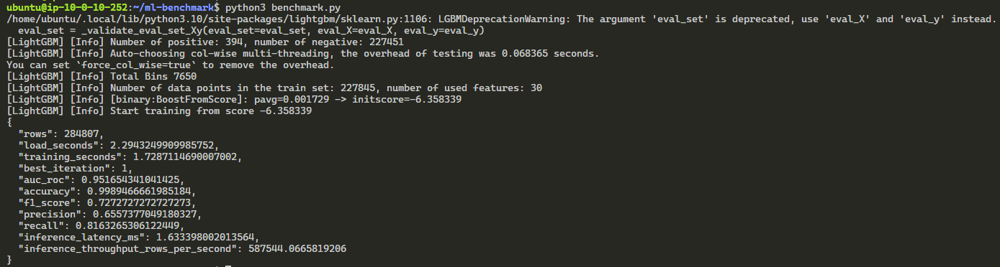
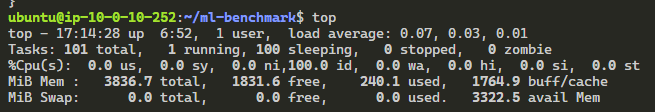
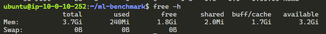
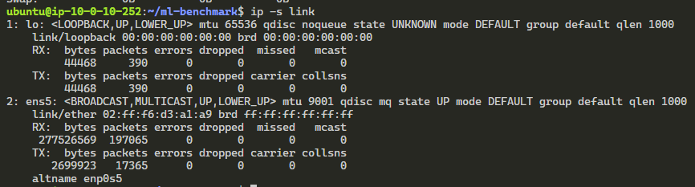
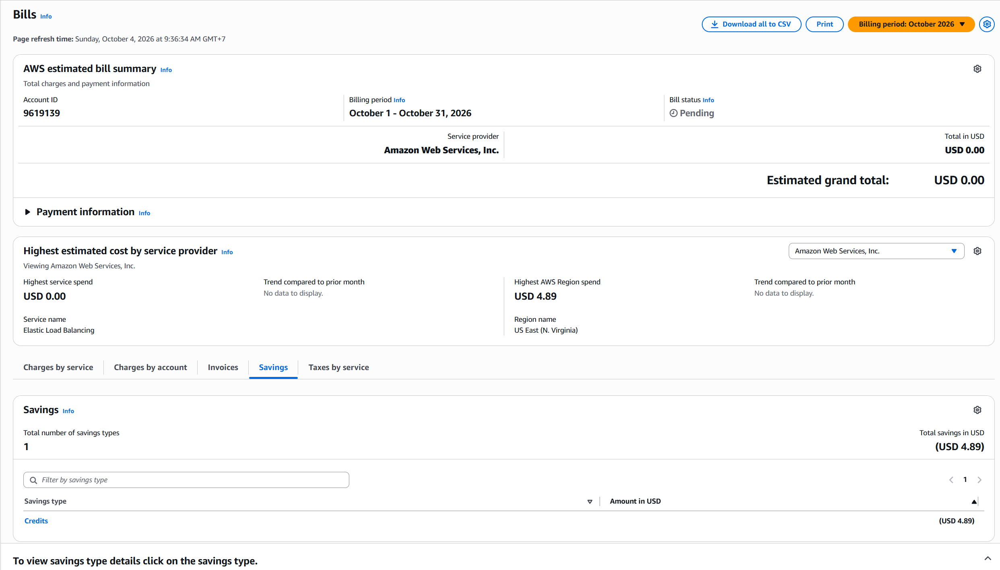

# BÁO CÁO LAB 16: CLOUD AI ENVIRONMENT SETUP TRÊN AWS

**Sinh viên:** Thái Hữu Tuấn  
**Nền tảng:** Amazon Web Services (AWS)  
**Công cụ triển khai:** Terraform  
**Khu vực:** `us-east-1`  
**Mô hình:** LightGBM trên CPU

## 1. Mục tiêu

Bài lab triển khai một môi trường Machine Learning trên AWS bằng Terraform. Hạ tầng gồm VPC, public/private subnet, Internet Gateway, NAT Gateway, Bastion Host, CPU Compute Node và Application Load Balancer. Mô hình LightGBM được huấn luyện trên bộ dữ liệu Credit Card Fraud Detection để đánh giá thời gian huấn luyện, chất lượng dự đoán và tốc độ inference.

## 2. Hạ tầng triển khai

| Thành phần | Cấu hình |
|---|---|
| AWS Region | `us-east-1` |
| Bastion Host | EC2 `t3.micro`, public subnet |
| Compute Node | EC2 `t3.medium`, private subnet |
| Compute Node IP | `10.0.10.252` |
| Bastion Public IP | `44.215.110.146` |
| Kết nối Internet của Compute Node | NAT Gateway |
| Load Balancer | Application Load Balancer, HTTP port 80 |
| Chế độ triển khai | CPU, `enable_gpu=false` |

Compute Node không có public IP và được truy cập qua Bastion Host. NAT Gateway cho phép máy trong private subnet tải package Python và dataset. ALB chưa phục vụ API trong luồng CPU nên target ở cổng 8000 có thể ở trạng thái `unhealthy`; đây là trạng thái dự kiến của bài lab.

## 3. Dữ liệu và phương pháp

- Dataset: Credit Card Fraud Detection từ Kaggle (`mlg-ulb/creditcardfraud`).
- Số bản ghi: 284.807.
- Mô hình: `LGBMClassifier`.
- Dữ liệu được chia thành tập train và test có giữ tỷ lệ lớp bằng `stratify`.
- Mô hình được đánh giá bằng AUC-ROC, Accuracy, F1-Score, Precision và Recall.
- Hiệu năng inference được đo với một bản ghi và một batch 1.000 bản ghi.

## 4. Kết quả benchmark

| Metric | Kết quả |
|---|---:|
| Số bản ghi | 284.807 |
| Thời gian load dữ liệu | 2,319 giây |
| Thời gian training | 1,747 giây |
| Best iteration | 1 |
| AUC-ROC | 0,951654 |
| Accuracy | 0,998947 (99,8947%) |
| F1-Score | 0,727273 |
| Precision | 0,655738 (65,57%) |
| Recall | 0,816327 (81,63%) |
| Inference latency, 1 dòng | 1,626 ms |
| Inference throughput, 1.000 dòng | 569.139 dòng/giây |

File số liệu đầy đủ: [benchmark_result.json](benchmark_result.json).

## 5. Nhận xét kết quả

Mô hình hoàn thành huấn luyện trong khoảng 1,75 giây trên EC2 `t3.medium`, cho thấy LightGBM phù hợp với dữ liệu dạng bảng và không cần GPU cho bài toán này. AUC-ROC đạt khoảng 0,952, thể hiện khả năng phân biệt giao dịch gian lận và bình thường tốt. Accuracy gần 99,9% nhưng cần thận trọng khi diễn giải vì dataset mất cân bằng mạnh. Recall đạt 81,63%, nghĩa là mô hình phát hiện được phần lớn giao dịch gian lận, trong khi Precision 65,57% cho thấy vẫn tồn tại một số cảnh báo sai. F1-Score 0,727 phản ánh sự cân bằng tương đối giữa Precision và Recall. Độ trễ dự đoán một dòng khoảng 1,63 ms và throughput batch đạt khoảng 569 nghìn dòng/giây, đáp ứng tốt nhu cầu inference CPU của bài lab. `best_iteration=1` cho thấy early stopping dừng rất sớm; khi tối ưu mô hình thực tế cần xem lại tập validation và hyperparameter.

## 6. Tài nguyên hệ thống

### CPU

Ảnh chụp sau benchmark cho thấy CPU ở trạng thái nhàn rỗi, `100% idle`, không có tiến trình zombie và load average thấp.

### RAM

Instance có khoảng 3,7 GiB RAM. Tại thời điểm kiểm tra, hệ thống sử dụng khoảng 240 MiB, còn khoảng 3,2 GiB available và không cấu hình swap.

### Network

Interface chính là `ens5`. Tại thời điểm ghi nhận, máy đã nhận khoảng 277,5 MB và gửi khoảng 2,7 MB dữ liệu; không ghi nhận packet error hoặc packet drop.

## 7. Chi phí

AWS Bills tháng 10/2026 ghi nhận mức sử dụng 4,89 USD tại khu vực US East (N. Virginia). Khoản AWS Credits 4,89 USD đã bù toàn bộ chi phí nên tổng tiền ước tính cần thanh toán là 0,00 USD. Elastic Load Balancing được hiển thị là dịch vụ có mức sử dụng cao nhất tại thời điểm chụp.

## 8. Kết luận

Hạ tầng AWS đã được triển khai thành công bằng Terraform và Compute Node được đặt trong private subnet. LightGBM xử lý toàn bộ 284.807 bản ghi nhanh trên CPU, đạt AUC-ROC tốt và độ trễ inference thấp. Kết quả cho thấy `t3.medium` đủ đáp ứng bài benchmark này mà không cần GPU. Sau khi hoàn tất thu thập bằng chứng và tải kết quả về máy local, cần chạy `terraform destroy` để tránh tiếp tục phát sinh chi phí.

## 9. Danh sách tài liệu nộp

- [x] Kết quả chạy `benchmark.py`.
- [x] File `benchmark_result.json`.
- [x] Ảnh CPU.
- [x] Ảnh RAM.
- [x] Ảnh Network.
- [x] Ảnh AWS Billing/Cost Explorer.
- [x] Mã nguồn Terraform.
- [x] Báo cáo kết quả.
